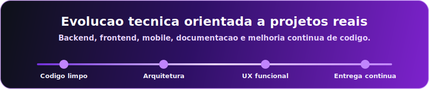

## Live Threat Map

---

## Sobre mim

Sou **Divanildo**, desenvolvedor em evolu&ccedil;&atilde;o constante, com foco em construir aplica&ccedil;&otilde;es bem estruturadas, escal&aacute;veis e com boa experi&ecirc;ncia para o usu&aacute;rio. Tenho interesse em desenvolvimento **web**, **mobile**, **backend**, integra&ccedil;&atilde;o de sistemas e boas pr&aacute;ticas de engenharia de software.

Minha abordagem combina aprendizado cont&iacute;nuo, organiza&ccedil;&atilde;o de c&oacute;digo e aten&ccedil;&atilde;o aos detalhes. Busco criar projetos que n&atilde;o sejam apenas funcionais, mas tamb&eacute;m f&aacute;ceis de manter, documentados e preparados para evoluir.

 

---

## Stack principal

### Linguagens

### Frameworks, ferramentas e ecossistema

---

## Projetos em destaque

| Projeto | Tipo | Destaque |
| --- | --- | --- |
| [**ROCKET-BANK-MOBILE**](https://github.com/Divinha2023/ROCKET-BANK-MOBILE) | Mobile | Projeto com foco em experi&ecirc;ncia banc&aacute;ria digital e desenvolvimento com TypeScript |
| [**SHATTERES-CROWN-RPG-GAME**](https://github.com/Divinha2023/SHATTERES-CROWN-RPG-GAME) | Game/Web | Projeto de RPG com foco em l&oacute;gica, intera&ccedil;&atilde;o e estrutura de jogo |
| [**Academia-Accenture-Entrega4.3**](https://github.com/Divinha2023/Academia-Accenture-Entrega4.3) | Backend/Java | Entrega acad&ecirc;mica aplicando fundamentos de programa&ccedil;&atilde;o em Java |
| [**Sistema-de-Gerenciamento-de-Biblioteca**](https://github.com/Divinha2023/Sistema-de-Gerenciamento-de-Biblioteca) | Sistema | Solu&ccedil;&atilde;o voltada para organiza&ccedil;&atilde;o e gerenciamento de biblioteca |
| [**Teste-BSLTECH**](https://github.com/Divinha2023/Teste-BSLTECH) | Web/Laravel | Projeto com base em PHP e Laravel |

---

  

---

## Compet&ecirc;ncias profissionais

| Engenharia | Produto | Colabora&ccedil;&atilde;o |
| --- | --- | --- |
| C&oacute;digo limpo e organizado | Foco em usu&aacute;rio e valor entregue | Comunica&ccedil;&atilde;o clara |
| Versionamento com Git/GitHub | Interfaces objetivas e funcionais | Aprendizado cont&iacute;nuo |
| Estrutura&ccedil;&atilde;o de projetos | Evolu&ccedil;&atilde;o incremental | Documenta&ccedil;&atilde;o t&eacute;cnica |
| Boas pr&aacute;ticas de manuten&ccedil;&atilde;o | Aten&ccedil;&atilde;o a detalhes | Mentalidade de equipe |

---

## Objetivos atuais

- Aprofundar conhecimentos em **Java**, backend e arquitetura de sistemas.
- Evoluir aplica&ccedil;&otilde;es **mobile** com TypeScript e boas pr&aacute;ticas de organiza&ccedil;&atilde;o.
- Melhorar documenta&ccedil;&atilde;o, testes, padroniza&ccedil;&atilde;o e qualidade dos reposit&oacute;rios.
- Construir projetos com mais maturidade t&eacute;cnica, visual profissional e valor real.

---

## Contato

---

### "Tecnologia bem aplicada transforma problemas reais em solu&ccedil;&otilde;es simples, elegantes e escal&aacute;veis."

 

